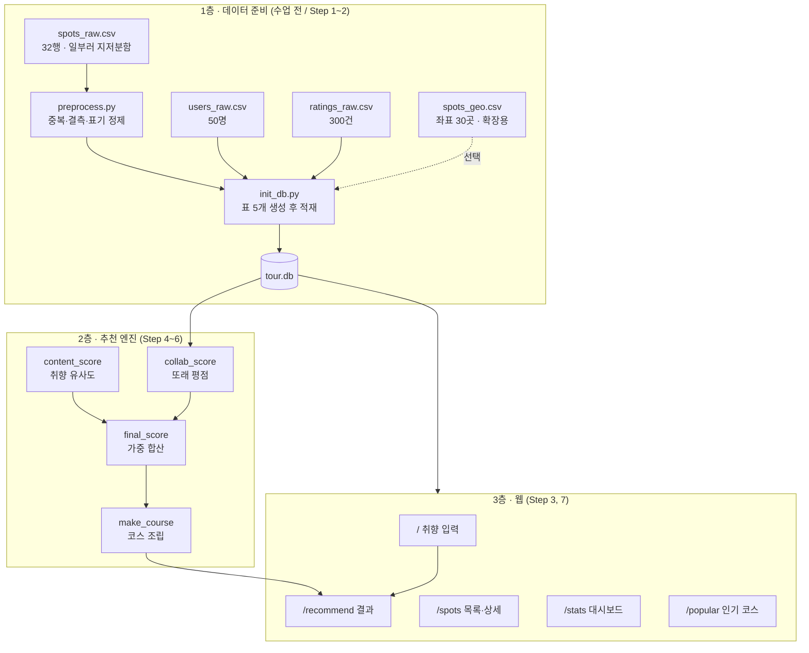
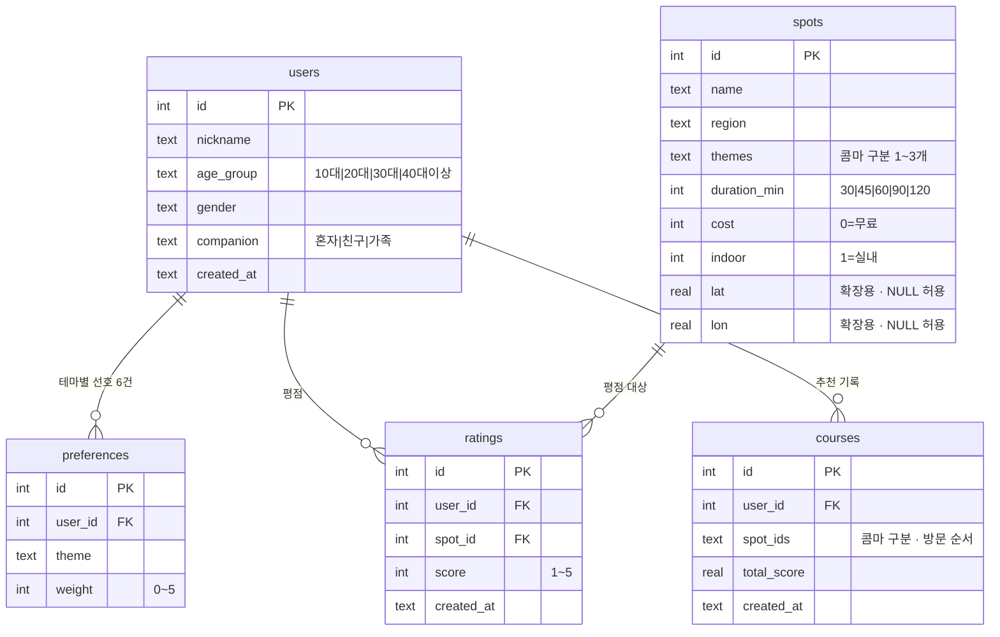
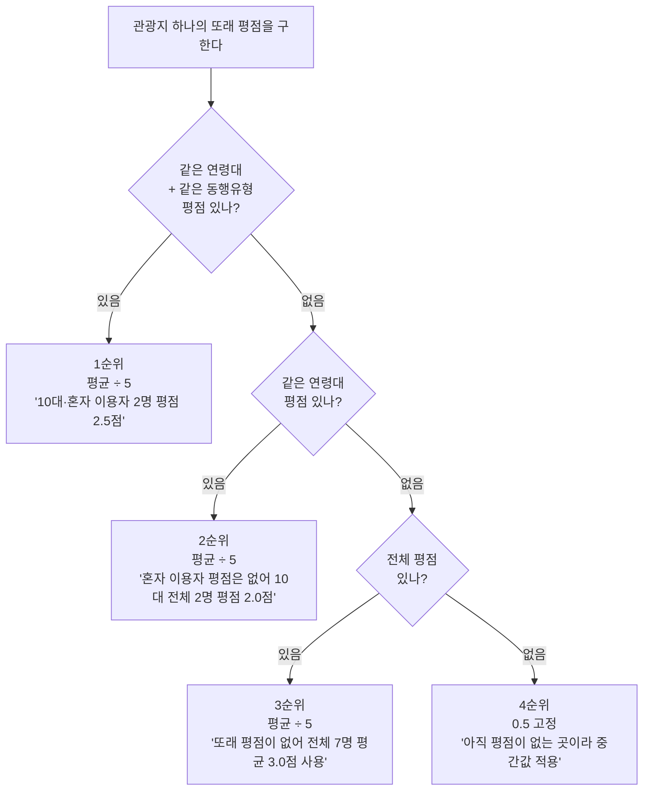
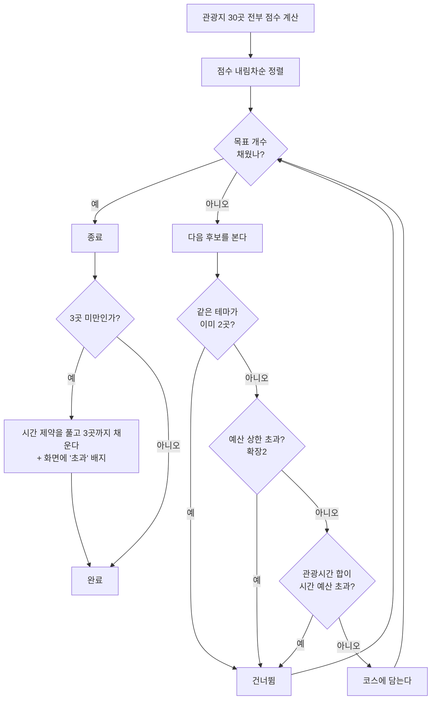
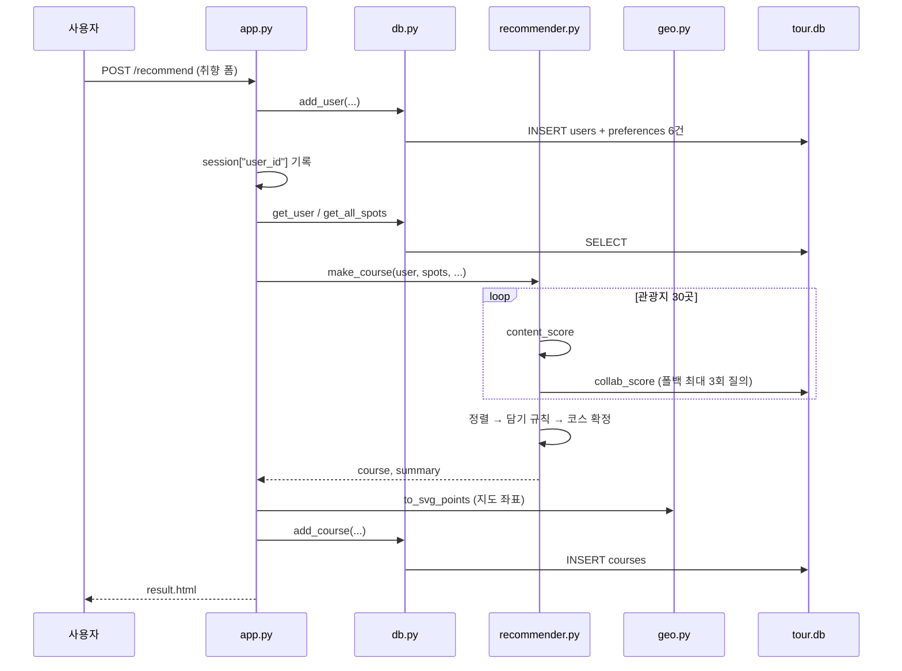
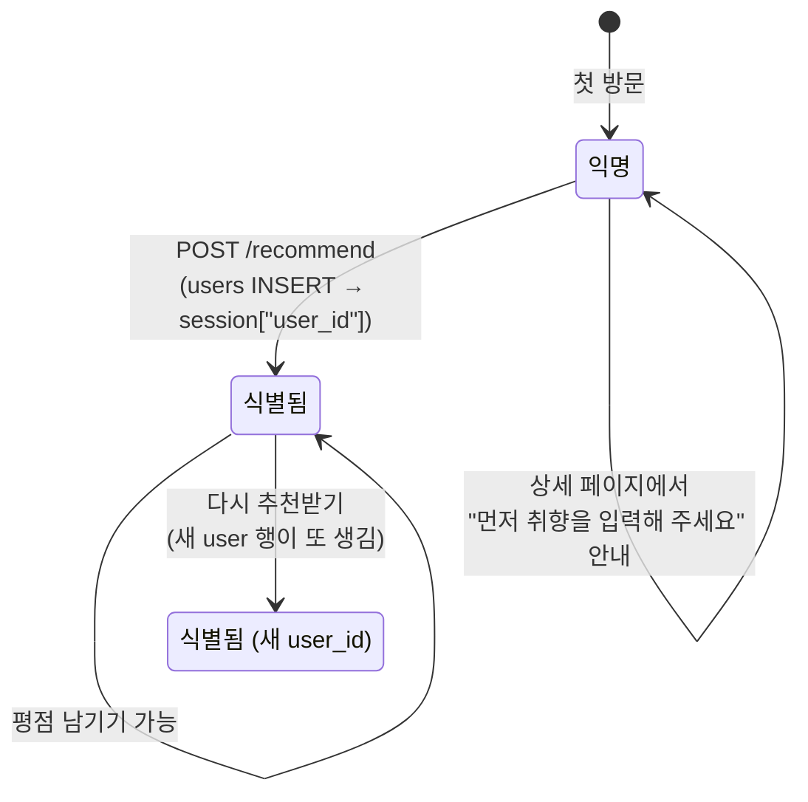

# AI 관광 추천 서비스 — 동작 로직

> 대상 코드: 충청남도 공주시 관광지 30곳 기준 완성본
> 이 문서는 **실제로 무엇이 어떤 순서로 일어나는가**를 적는다.
> 왜 그렇게 설계했는지는 [최종 개발기획안](AI관광추천_최종개발기획안_v2.md)에 있다.
> 여기 실린 숫자와 로그는 전부 실행 결과를 그대로 옮긴 것이다.

---

## 목차

1. [전체 구조](#1-전체-구조)
2. [데이터 준비 파이프라인](#2-데이터-준비-파이프라인)
3. [데이터베이스 구조](#3-데이터베이스-구조)
4. [추천 점수 계산](#4-추천-점수-계산)
5. [코스 생성 알고리즘](#5-코스-생성-알고리즘)
6. [화면별 요청 처리 흐름](#6-화면별-요청-처리-흐름)
7. [상태 관리 — 세션](#7-상태-관리--세션)
8. [확장 기능 동작](#8-확장-기능-동작)
9. [예외·경계 상황 처리](#9-예외경계-상황-처리)
10. [파일별 책임](#10-파일별-책임)
11. [검증 체계](#11-검증-체계)

---

## 1. 전체 구조

시스템은 **세 층**으로 나뉜다. 아래층이 끝나야 위층이 동작한다.



**핵심 원칙 세 가지**

| 원칙 | 이유 |
|---|---|
| 외부 API·라이브러리를 쓰지 않는다 | numpy·차트 라이브러리·지도 API 전부 없음. 계산 과정을 손으로 따라갈 수 있어야 하기 때문 |
| JavaScript를 쓰지 않는다 | 모든 상호작용이 폼 제출로 이뤄진다 |
| 확장 기능은 기본값이 꺼짐 | 심화 기능이 기본 동작을 바꾸지 않는다 |

---

## 2. 데이터 준비 파이프라인

### 2.1 왜 원본이 지저분한가

`spots_raw.csv`는 **일부러 오염돼 있다.** Step 1(데이터 점검)과 Step 2(정제)가 수업의
1단계 전부인데, 깨끗한 CSV를 주면 그 3개 차시가 통째로 사라지기 때문이다.

### 2.2 정제 규칙 3가지 (`preprocess.py`)

```
① 관광지명 중복 제거   — 앞뒤 공백을 없앤 뒤 이미 나온 이름이면 버린다
② 소요시간 결측 보정   — 빈칸이면 60분으로 채운다
③ 테마 표기 통일       — 별칭표로 표준 6개 이름에 맞춘다
```

별칭표(`THEME_ALIAS`)

| 원본 표기 | 표준 |
|---|---|
| 역사유적 | 역사 |
| 자연경관 | 자연 |
| 먹거리 | 맛집 |
| 포토존 | 사진스팟 |
| 힐링 | 휴식 |
| 체험학습 | 체험 |

표에 없는 값이 나오면 `ValueError`를 던지고 멈춘다. 조용히 넘어가면 잘못된 테마가
DB에 들어가 벡터 계산이 어긋나기 때문이다.

### 2.3 실제 정제 결과

```
정제 전 : 32행
정제 후 : 30행
  중복 제거      : 2건   (공산성, 마곡사)
  소요시간 보정  : 3건   (신원사, 고마나루솔밭, 대통길작은미술관)
  테마 표기 통일 : 19건
```

이 **32 → 30** 이라는 숫자가 평가 루브릭 '데이터 정제 20점'의 채점 기준이다.

### 2.4 CSV 읽기 — pandas 없이도 동작한다

```python
try:
    import pandas as pd
    return pd.read_csv(path, encoding="utf-8-sig", keep_default_na=False).to_dict("records")
except ImportError:
    # 학교 PC에 pandas 설치가 막혀도 수업이 멈추지 않게 기본 csv 모듈로 넘어간다
    with open(path, encoding="utf-8-sig") as f:
        return list(csv.DictReader(f))
```

`encoding="utf-8-sig"`가 **모든 CSV 읽기에 고정**돼 있다. 엑셀이 저장한 한글 CSV는
파일 맨 앞에 보이지 않는 표시(BOM)가 붙는데, 그냥 `utf-8`로 읽으면 첫 컬럼 이름이 깨진다.

> 실측: pandas·numpy import를 차단한 상태에서도 정제 30행, `content_score` 0.6736,
> 코스 생성, 전 화면 200 응답이 모두 정상이었다.

### 2.5 적재 (`init_db.py`)

```
① 표 5개 생성 (spots, users, preferences, ratings, courses)
② 관광지 30곳 INSERT
③ spots_geo.csv 가 있으면 lat/lon UPDATE   ← 없어도 무방
④ 이용자 50명 INSERT + 선호 테마 300건 INSERT
⑤ 평점 300건 INSERT (닉네임·관광지명을 id로 변환)
```

**재실행 안전장치가 이 파일의 핵심이다.**

```python
if os.path.exists(DB_PATH) and not reset:
    # 아무것도 하지 않고 현재 평점 건수만 알려 준다
```

인자 없이 실행하면 기존 DB를 건드리지 않는다. `--reset`을 붙였을 때만 지우고 다시 만든다.
이게 없으면 Step 7~8에서 학생이 수업 중 남긴 평점이 통째로 날아간다.

---

## 3. 데이터베이스 구조



### 설계상 알아둘 점 3가지

**`themes`와 `spot_ids`는 한 칸에 여러 값을 넣는다.**
정규화 관점에서는 좋지 않지만, 별도 연결 테이블을 만들면 학생이 JOIN을 3개씩 써야 한다.
대신 세는 작업은 SQL이 아니라 파이썬에서 문자열을 쪼개 처리한다.

```python
# db.stats_theme_counts — SQL 한 줄로는 셀 수 없어 파이썬으로 푼다
for row in conn.execute("SELECT themes FROM spots"):
    for t in row["themes"].split(","):
        counts[t] += 1
```

**시드 이용자 50명은 12조합을 모두 채운다.**
연령 4 × 동행 3 = 12조합에 순서대로 배정하므로 어떤 조합도 0명이 되지 않는다.
협업 필터링 1순위가 최소한 한 번은 성립하도록 보장하기 위함이다.

**평점이 하나도 없는 관광지를 2곳 남겨 뒀다.**
대통길작은미술관, 자연미술관Ko. 신규 등록 관광지 상황을 만들어
협업 필터링 폴백 4순위가 실제로 발동하는지 볼 수 있게 한 것이다.

---

## 4. 추천 점수 계산

관광지 하나당 점수는 **두 축을 섞어서** 만든다.

```
최종 점수 = w × 취향 점수 + (1 - w) × 또래 평점 점수      (기본 w = 0.6)
```

### 4.1 취향 점수 — `content_score`

테마 6개의 **순서가 고정**돼 있고, 그 순서가 곧 벡터의 자리번호다.

```
역사(0) · 자연(1) · 체험(2) · 맛집(3) · 사진스팟(4) · 휴식(5)
```

내 선호와 관광지 테마를 각각 6칸 벡터로 바꾼 뒤 **코사인 유사도**를 잰다.

```
내 선호        [5, 3, 0, 4, 2, 0]      역사5 자연3 체험0 맛집4 사진2 휴식0
공산성         [1, 0, 0, 0, 1, 0]      테마: 역사, 사진스팟

내적    = 5×1 + 3×0 + 0×0 + 4×0 + 2×1 + 0×0 = 7
크기A   = √(25+9+0+16+4+0) = √54 = 7.3485
크기B   = √(1+0+0+0+1+0)   = √2  = 1.4142
점수    = 7 ÷ (7.3485 × 1.4142) = 0.6736
```

이 **0.6736**이 `verify.py` 6번 항목의 기준값이다. 코드 출력이 소수점 4자리까지
같은지 자동으로 확인한다. 학생은 5-6차시에 이 계산을 공책에 직접 해 본다.

> 예외: 테마에 전부 0점을 주면 벡터 크기가 0이 되어 나눗셈이 불가능하다.
> 이때는 0.0을 돌려준다.

### 4.2 또래 평점 점수 — `collab_score` (폴백 4단계)

"나와 비슷한 사람 = 같은 연령대 + 같은 동행유형"으로 단순화했다.
그런데 그 조건만 쓰면 12조합 × 약 4명이라, 대부분의 관광지가 중립값 0.5로 깔려
추천이 밋밋해진다. 그래서 **앞 단계에 데이터가 없으면 다음으로 넘어간다.**



**이 함수는 점수와 근거 문구를 함께 돌려준다.**

```python
return row[0] / 5, f"{age}·{comp} 이용자 {row[1]}명 평점 {row[0]:.1f}점"
```

몇 순위가 쓰였는지를 화면에 그대로 노출하기 위한 설계다. 폴백은 우회가 아니라
**"데이터가 부족할 때 어떻게 하는가(cold start)"를 가르치는 장치**이므로, 감추면 의미가 없다.

`verify.py` 7번 항목이 12조합 × 30곳을 전부 돌려 **4단계가 모두 최소 1회 발동하는지** 확인한다.

### 4.3 합산과 추천 이유

```python
final = w_content * content + (1 - w_content) * collab
```

`w_content`를 키우면 내 취향을, 줄이면 남들 평점을 더 믿는다.
결과 화면의 슬라이더로 0.0~1.0을 바꿔 가며 순서 변화를 관찰할 수 있다.

**추천 이유 문장에는 함정이 하나 있다.**

```python
# 틀린 방법 — 관광지의 첫 번째 테마를 쓴다
best = spot["themes"].split(",")[0]

# 맞는 방법 — 그 관광지의 테마 중 '내가 가장 높은 점수를 준' 것을 고른다
best = max(owned, key=lambda t: user_pref.get(t, 0))
```

베이커리밤마을의 테마는 `맛집,사진스팟`이다. 맛집 2점·사진스팟 5점을 준 학생에게
첫 번째 테마를 써서 *"선호하신 '맛집' 테마"* 라고 하면 완전히 틀린 설명이 된다.
그 테마에 0점을 준 경우에는 취향이 아니라 평점 때문에 추천된 것이므로
`"취향과는 다르지만 …"`으로 문장을 바꾼다.

---

## 5. 코스 생성 알고리즘

### 5.1 시간을 다루는 방식 ★

여행 시간은 **중단 조건이 아니라 목표 개수**로 환산한다.

| 선택 | 목표 개수 | 시간 예산 |
|---|---|---|
| 3시간 | 3곳 | 180분 |
| 6시간 | 4곳 | 360분 |
| 9시간 | 5곳 | 540분 |

**시간 예산에는 관광 시간만 넣고, 이동시간은 넣지 않는다.**
표시용 총 소요시간만 따로 계산한다.

```
총 소요 = Σ(duration_min) + 20분 × (곳수 - 1)
화면 문구 예: "관광 2시간 15분 + 이동 40분 = 총 2시간 55분"
```

이동시간을 예산에 포함하면 3시간 코스의 **64%에서 폴백이 터진다**(시드 30곳 3000회
시뮬레이션 결과). 예외 배지가 3분의 2 확률로 뜨면 배지가 의미를 잃는다.
제외하면 15%로 떨어지고 6·9시간은 100% 목표를 채운다.

### 5.2 담기 규칙



**같은 테마 최대 2곳** 규칙이 없으면 취향이 한쪽으로 쏠린 학생에게 비슷한 곳만 나온다.

### 5.3 실제 실행 로그

10대·혼자 / 체험5 사진스팟5 / 3시간으로 요청한 결과 (`show=True`)

```
  건너뜀: 임립미술관 — '사진스팟' 테마가 이미 2곳
  건너뜀: 대통길작은미술관 — '사진스팟' 테마가 이미 2곳
--- 결과 ---
1. 곡물집 (45분) score=0.8201
2. 베이커리밤마을 (30분) score=0.8116
3. 공주목재문화체험장 (60분) score=0.6838
요약: 135분 관광 + 40분 이동 = 175분 / 예산 180분
```

건너뛴 이유를 콘솔에 남기는 것이 중요하다. 학생이 알고리즘의 판단 과정을 눈으로 볼 수 있어야 한다.

### 5.4 추천이 사람마다 갈리는지 — 데모 성패 기준

`verify.py` 10번 항목이 이걸 자동으로 검사한다. 실측 결과(6시간):

```
10대·혼자     : 곡물집, 베이커리밤마을, 공주목재문화체험장, 계룡산상신농촌체험휴양마을
40대이상·가족 : 마곡사, 신원사, 대장이랜드중장농촌체험휴양마을, 공산성본가
```

카페·체험 위주 vs 사찰·역사 위주로 갈린다. 겹치는 곳이 거의 없다.
이게 실패하면 알고리즘이 정확해도 수업에서 "그래서 뭐가 달라진 건데?"로 끝난다.

---

## 6. 화면별 요청 처리 흐름

| 메서드 | 경로 | 하는 일 |
|---|---|---|
| GET | `/` | 취향 입력 폼 |
| POST | `/recommend` | 이용자 저장 → 세션 기록 → 코스 생성 → 코스 기록 → 렌더 |
| GET | `/spots` | 목록 (`?theme=` 필터) |
| GET | `/spots/<id>` | 상세 + 평균 평점 + 평점 폼 |
| POST | `/spots/<id>/rate` | 평점 저장 후 상세로 리다이렉트 |
| GET | `/popular` | 인기 코스 (`?days=` 1/7/30) |
| GET | `/stats` | 데이터 대시보드 |

### 6.1 추천 요청 한 건이 처리되는 순서



`collab_score`가 관광지마다 최대 3회 질의하므로 30곳이면 최대 90회 쿼리가 나간다.
관광지가 30곳뿐이라 체감 지연이 없고, 코드가 단순해 학생이 읽기 쉽다.
캐시나 배치 조회로 최적화하지 않은 것은 의도적인 선택이다.

### 6.2 `/stats` 계산

| 항목 | 방식 |
|---|---|
| 테마별 관광지 수 | `themes` 문자열을 파이썬에서 쪼개 센다 (합계가 30을 넘음 — 관광지 하나가 테마 여러 개) |
| 연령대별 선호 테마 TOP3 | `preferences` × `users` JOIN → 연령대별 평균 weight |
| 평균 평점 상위 10곳 | `ratings` × `spots` JOIN → `GROUP BY spot ORDER BY AVG DESC` |

막대그래프는 최댓값 대비 퍼센트를 서버에서 계산해 `div`의 `width`로 넘긴다.
차트 라이브러리를 쓰지 않는다.

### 6.3 가중치 재추천 — JavaScript 0줄

결과 화면 아래에 폼이 하나 더 있다. 이전 입력값을 전부 `hidden`으로 다시 싣고
`<input type="range">` 하나만 추가한 뒤 `/recommend`로 다시 POST한다.

```html
<input type="hidden" name="age_group" value="{{ user.age_group }}">
...
<input type="range" name="w_content" min="0" max="1" step="0.1" value="{{ w_content }}">
<button>이 설정으로 다시 추천</button>
```

슬라이더를 움직이는 즉시 반영되지는 않지만, 버튼을 누르면 화면이 새로 그려진다.
JS를 쓰지 않으므로 디버깅할 것도 없다.

---

## 7. 상태 관리 — 세션

로그인도 회원가입도 없다. 대신 Flask `session` 쿠키 하나만 쓴다.



**추천받을 때마다 `users` 행이 새로 생긴다.** 같은 사람이 3번 추천받으면 3명으로 기록된다.
수업용으로는 이게 오히려 낫다 — `/stats`와 `/popular`에 데이터가 빨리 쌓이고,
"한 사람이 여러 번 쓰면 통계가 어떻게 되나?"라는 토론거리가 생긴다.

평점은 `user_id + spot_id`로 중복을 막는다. 같은 사람이 같은 곳에 두 번 주면
새 행을 만들지 않고 점수를 갱신한다.

세션이 없는 상태로 상세 페이지에 오면 평점 폼 대신 안내가 뜬다.
`POST /rate`도 `user_id`가 없으면 첫 화면으로 리다이렉트한다.

---

## 8. 확장 기능 동작

확장 5개는 전부 **기본값이 꺼짐**인 선택 인자다. 아무것도 주지 않으면 기본 동작과
완전히 같다. 이 불변성은 `verify.py` 13항목이 회귀 테스트로 보증한다.

```python
def make_course(user, spots, conn, hours=3, w_content=0.6, show=False,
                weather=None, max_cost=None, real_distance=False):
```

| # | 확장 | 동작 | 실측 효과 |
|---|---|---|---|
| 1 | 날씨 | `indoor=1`인 곳에 점수 가산 (비 +0.15, 더움·추움 +0.10) | 실내 1/4곳 → **4/4곳** |
| 2 | 예산 상한 | 누적 비용이 상한을 넘으면 그 관광지를 건너뜀 | 13,000원 → **8,000원** |
| 3 | 코스 지도 | 좌표를 SVG 점으로 변환 | 지도 API 없이 렌더 |
| 4 | 인기 코스 | `courses` 누적 기록 집계 | 28건 → TOP10 산출 |
| 5 | 실제 이동시간 | 하버사인 거리 × 1.3 ÷ 40km/h, 5분 단위 반올림, 최소 10분 | 이동 60분 → **70분** |

### 8.1 거리 계산 검산

```
공산성 → 국립공주박물관   직선  1.3km → 10분   (최소값 적용)
공산성 → 마곡사          직선 14.7km → 30분
마곡사 → 동학사          직선 29.4km → 55분
```

좌표는 30곳 전부 **네이버 지역검색 결과의 `mapx`/`mapy`** 값이다(÷10⁷ = 경도·위도).
지어낸 좌표는 하나도 없다.

### 8.2 지도를 그리는 방식과 두 번의 수정

지도 API를 쓰지 않는다. 경도·위도를 SVG 좌표로 환산해 점을 찍을 뿐이다.
위도 1도와 경도 1도의 실제 길이가 다르므로 `cos(위도)`로 가로를 보정한다.

만들면서 두 가지를 고쳤다.

**(가) 코스가 한 점으로 뭉갰다.**
30곳 전체(약 30km)에 축척을 맞추니, 코스가 전부 원도심(반경 1.5km)일 때
점 네 개가 겹쳐 알아볼 수 없었다.
→ 축척을 **코스에 담긴 곳 기준**으로 잡고 1.6배 여유를 준다. 최소 범위는 위도 0.02도(약 2.2km).
범위 밖 관광지는 그리지 않는다.

**(나) 이름표가 계속 충돌했다.**
원도심 관광지는 서로 1km 안쪽이라 위아래로 번갈아 놓고 흰 테두리를 둘러도 겹쳤다.
→ **지도에서 이름표를 뺐다.** 번호 동그라미만 찍고 이름은 바로 아래 코스 목록이 담당한다.
번호가 목록과 1:1 대응하므로 정보 손실이 없고, 충돌 문제 자체가 사라진다.
그래도 겹치는 동그라미는 최소 34px까지 서로 밀어내고(`geo.separate()`),
"위치를 조금 벌려 놓았다"고 화면에 명시한다.

### 8.3 인기 코스 집계

`courses.spot_ids`가 `'3,7,12'` 형태라 SQL만으로는 셀 수 없다.
최근 N일 행을 가져와 파이썬에서 쪼개 센다.

```python
for r in rows:
    for sid in r["spot_ids"].split(","):
        count[int(sid)] = count.get(int(sid), 0) + 1
```

코스 *조합* 순위는 `spot_ids` 문자열을 그대로 `GROUP BY` 하면 되므로 SQL로 처리한다.

---

## 9. 예외·경계 상황 처리

| 상황 | 어디서 | 어떻게 처리하나 |
|---|---|---|
| 테마에 전부 0점 | `cosine()` | 벡터 크기 0 → 나눗셈 불가 → **0.0 반환** |
| 그 관광지에 평점 0건 | `collab_score()` | 폴백 4순위 → **0.5(중립)** |
| 조건에 맞는 곳이 3곳 미만 | `make_course()` | 시간 제약 해제 후 3곳 채움 + **초과 배지 표시** |
| 좌표가 없는 관광지 | `geo.travel_minutes()` | `None` 반환 → 부르는 쪽이 **기본 20분** 사용 |
| `spots_geo.csv` 자체가 없음 | `init_db.py` | 좌표 적재를 건너뜀. **기본 기능은 그대로 동작** |
| pandas 미설치 | `preprocess.read_csv()` | 표준 `csv` 모듈로 자동 전환 |
| 세션 없이 평점 시도 | `/spots/<id>/rate` | 첫 화면으로 리다이렉트 |
| 같은 곳에 평점 두 번 | `db.add_rating()` | 새 행 대신 **점수 갱신** |
| DB 없이 서버 실행 | `app.py` `__main__` | 안내 메시지 출력 후 서버를 켜지 않음 |
| DB 있는데 `init_db` 재실행 | `init_db.py` | **아무것도 안 함** + 현재 평점 건수 안내 |
| 없는 관광지 id 요청 | `/spots/<id>` | **404** |
| 테마 별칭표에 없는 값 | `normalize_themes()` | `ValueError`로 **즉시 중단** (조용히 넘어가면 벡터가 어긋남) |

---

## 10. 파일별 책임

```
tour-ai/
├── app.py               라우팅 7개, 폼 입력 해석, 세션 관리        (176줄)
├── recommender.py       점수 계산 + 코스 조립 ★핵심 학습 파일      (289줄)
├── db.py                SQL을 한곳에 모음 (app.py는 SQL을 안 씀)  (196줄)
├── geo.py               거리·지도 좌표 (확장 전용, 기본은 미사용)
├── data/
│   ├── spots_raw.csv        관광지 원본 32행 · 일부러 지저분함
│   ├── spots_geo.csv        좌표 30곳 (확장 3·5용, 없어도 됨)
│   ├── users_raw.csv        가상 이용자 50명 + 선호 테마
│   ├── ratings_raw.csv      평점 300건
│   ├── _expected_spots.csv  정제 정답 (교사용)
│   └── tour.db              SQLite
├── scripts/
│   ├── make_seed.py         시드 생성 + 편향 주입      (교사 전용)
│   ├── preprocess.py        정제 3규칙
│   ├── init_db.py           표 생성·적재 + --reset 분기
│   ├── verify.py            완성본 검증 13항목        (교사 전용)
│   ├── check_prompts.py     대본↔완성본 정합성 12항목  (교사 전용)
│   ├── make_snapshots.py    단계별 완성본 자동 생성    (교사 전용)
│   └── make_offline_kit.py  오프라인 설치 키트        (교사 전용)
├── templates/           base · index · result · spots · spot_detail · stats · popular
└── static/style.css     단일 CSS · 색 3개
```

**학생이 실제로 이해해야 하는 파일은 `recommender.py` 하나다.**
나머지는 그것이 동작하도록 받쳐 주는 껍데기다.

**교사 전용 스크립트 4개는 학생 배포본에서 빼도 된다.**

`make_snapshots.py`는 단계별 완성본(`step2_done`~`step7_done`)을 손으로 만들지 않고
**완성본에서 잘라내 자동 생성**한다. 6개 폴더를 복사해 두면 `recommender.py`를 고칠 때마다
전부 옛 코드로 남아, 진도 편차 대비책이 오히려 함정이 되기 때문이다.

---

## 11. 검증 체계

세 가지 검사가 서로 다른 것을 본다.

| 스크립트 | 무엇을 보는가 | 결과 |
|---|---|---|
| `verify.py` | 데이터·알고리즘이 의도대로 동작하는가 | **13 / 13** |
| `check_prompts.py` | 학생 대본과 완성본이 어긋나지 않는가 | **12 / 12** |
| `make_snapshots.py` + 실행 테스트 | 단계별 폴더가 각각 단독 실행되는가 | **6 / 6** |

### verify.py 13항목

```
 0. spots_raw.csv 32행 → 정제 후 30행
 1. 모든 테마가 표준 6개 안에만 존재
 2. 소요시간이 {30,45,60,90,120}, 평균 60.0분
 3. 관광지명 중복 0건
 4. 시드 이용자 50명 유지, 연령×동행 12조합 모두 1명 이상
 5. 평점 300건 이상, 점수 1~5
 6. content_score가 손계산 0.6736과 소수점 4자리까지 일치
 7. 협업 필터링 폴백 1·2·3·4순위가 각각 최소 1회 발동
 8. 3/6/9시간 → 각각 3/4/5곳
 9. 한 코스에 동일 테마 3곳 이상 없음
10. 10대·혼자 vs 40대이상·가족 코스가 최소 2곳 이상 다름   ← 데모 성패
11. 가중치 0.9 vs 0.1일 때 코스가 달라짐
12. init_db.py가 --reset 없이는 기존 DB를 건드리지 않음
```

**4·5번은 "정확히 50명 / 300건"이 아니라 "시드 50명 유지 / 300건 이상"으로 검사한다.**
정확한 수로 검사하면 학생이 앱을 한 번만 써도 `users`·`ratings`가 늘어 검증이 헛되이 실패한다.
교사가 수업 전날 돌리는 스크립트인데 그날 학생이 접속했다면 무조건 깨진다.
검사해야 할 것은 총량이 아니라 시드 보존 여부다.

### 확장 기능은 회귀 테스트로 보호된다

확장 5개를 붙인 뒤에도 `verify.py`가 계속 13/13을 통과한다.
확장이 기본 동작을 바꾸지 않았다는 것이 이 방식으로 증명된다.

### 기계가 확인할 수 없는 것

`check_prompts.py`가 보는 것은 *대본과 완성본이 서로 모순되지 않는가* 뿐이다.
**Claude Code가 그 프롬프트로 실제 어떤 코드를 만들어 낼지는 검사할 수 없다.**
빈 폴더에서 대본을 순서대로 넣어 완주해 보는 것은 사람이 한 번 직접 해야 한다.

또한 관광지 `cost`는 **교육용 추정치**다. 사찰 관람료는 2023년 면제 이후 0원으로 뒀지만
주차료는 별도이고 식당 가격도 변동한다. 실제 요금표가 아니라는 점을 수업에서 짚어야 한다.

---

## 부록. 실행 순서 요약

```bash
pip install flask pandas       # 최초 1회 (pandas는 없어도 동작)
python scripts/init_db.py      # DB 생성 (재실행해도 안전)
python app.py                  # http://127.0.0.1:5000
```

교사용

```bash
python scripts/make_seed.py        # 시드 CSV 다시 만들기
python scripts/verify.py           # 수업 전날 검증 13항목
python scripts/check_prompts.py    # 대본 정합성 12항목
python scripts/make_snapshots.py   # 단계별 완성본 폴더 생성
python scripts/make_offline_kit.py # 오프라인 설치 키트 (0.6MB)
```
